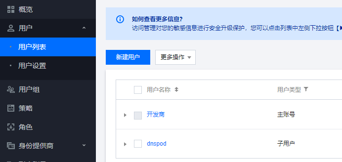
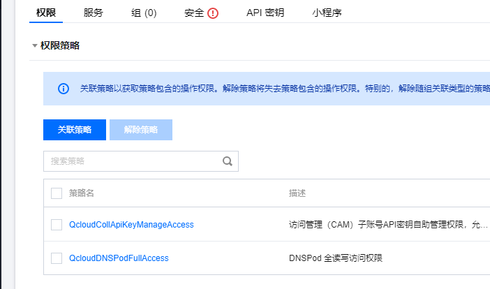
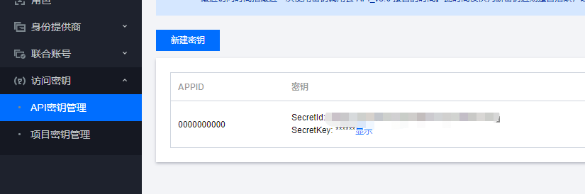
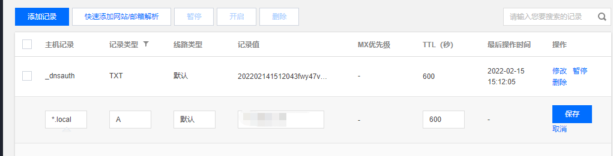
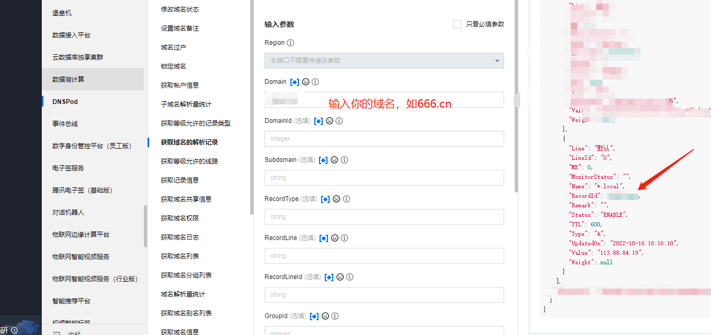
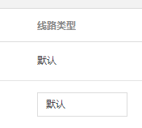
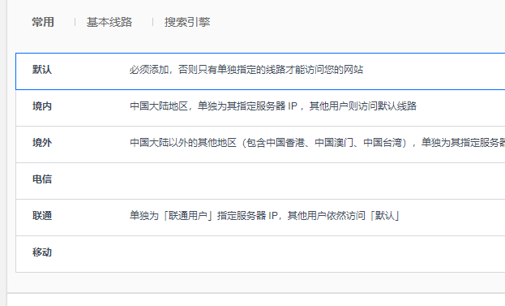

# DDNS

这是一个根据当前公网 IP 动态修改腾讯云域名记录的工具，如果宽带不是专线，那么 IP 会隔几天变化一次，这样给域名绑定带来麻烦。

此工具通过动态识别当前网络的公网 IP 地址，将变化的 IP 推送到腾讯云已有的域名解析中，实现域名动态绑定 IP。


### 下载


### 配置文件

需要在**运行程序的目录(执行命令的目录，而不是程序所在目录)**下，创建 `config.json` 文件，内容格式如下：

```json
{
  "SecretId": "id",
  "SecretKey": "密钥",
  "Domain":"666.cn",
  "SubDomain": "域名前缀",
  "RecordType": "记录类型，如 A、NX",
  "RecordLine": "线路名称",
  "Value": "123.123.123.123",
  "MX": 5,
  "TTL": 600,
  "RecordId": 1220273909
}
```


### 获取腾讯云 API 密钥

打开：https://console.cloud.tencent.com/cam/capi

创建或获取访问腾讯云 API 的密钥，**建议使用子账号**！




给子账号开通 `QcloudCollApiKeyManageAccess`、`QcloudDNSPodFullAccess ` 两个权限。





然后使用子账号登录控制台，打开 https://console.cloud.tencent.com/cam/capi

新建密钥：



复制 `SecretId` 和 `SecretKey`，存储到 `config.json` 中。


### 获取域名信息

打开 https://console.cloud.tencent.com/cns

找到自己的域名，先添加一个域名解析。




接下来要获取此解析记录的 id，即 `RecordId`。


方法①：

然后点击修改域名记录，但是先不保存，按下 F12，在点击保存。

在浏览器控制台中，可以看到一条请求：

```
https://wss.cloud.tencent.com/dns/api/record/update?g_tk={此解析记录的id}
```


根据这个请求，复制后面的记录 id。


方法②：

打开：https://console.cloud.tencent.com/api/explorer?Product=dnspod&Version=2021-03-23&Action=DescribeRecordList




将 `RecordId` 放到 `config.json` 中。


### 配置说明

经过以上步骤，目前还有以下配置需要修改：

```
  "Domain":"666.cn",
  "SubDomain": "域名前缀",
  "RecordType": "记录类型，如 A、NX",
  "RecordLine": "线路名称",
  "Value": "123.123.123.123",
  "MX": 5,
  "TTL": 600,
```


其实就是对应域名解析记录的，此程序只会动态修改 IP，其他修改内容会按照 `config.json` 的配置去区配解析记录并修改。

也可以看这里了解每个参数的说明:

https://docs.dnspod.cn/api/modify-records/


`RecordLine` 这个参数，指的是线路名称，可以填 `默认` 。






### Linux 定时任务

